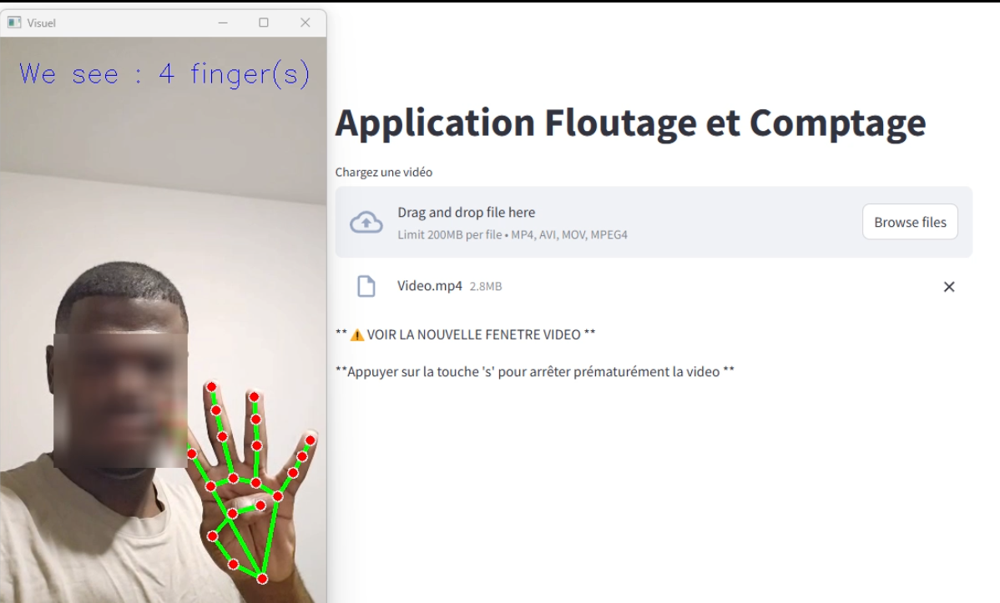

### 🖐️ FingerCount-and-FaceAnonymization 🎥

## 🚀 Description

**Finger Count & Face Blur App** est une application interactive développée avec **Streamlit**, **Mediapipe**, et **OpenCV**. Elle permet de **compter le nombre de doigts levés** dans une vidéo tout en **floutant le visage** pour protéger la vie privée des personnes.

Elle peut être utilisée pour diverses applications, telles que :
- Le comptage des doigts levés.
- L'anonymisation des visages dans des vidéos.
- La détection des gestes des mains. (Une variante possible)

## 📸 Aperçu de l'application

Voici une capture d'écran de l'interface de l'application en action :



## 🎥 Aperçu de l'application

Vous pouvez télécharger et visionner la vidéo ici :

[Voir la vidéo](https://github.com/Samuel-engineer/FingerCount-and-FaceAnonymization/raw/main/assets/demo-video.mp4)


## 📦 Installation

Suivez les étapes ci-dessous pour installer et exécuter l'application sur votre machine locale.

### Prérequis
- **Python 3.7+**
- **Pip** pour installer les dépendances

### Étapes d'installation

1. **Clonez le repo** :
   ```bash
   git clone https://github.com/ton-utilisateur/FingerCount-and-FaceAnonymization.git
   cd FingerCount-and-FaceAnonymization
2. **Créez un environnement virtuel (optionnel, mais recommandé)** :
   ```bash
   python -m venv venv
   source venv/bin/activate  # Sur Windows, utilisez `venv\Scripts\activate`
3. **Installez les dépendances** :
   ```bash
   pip install -r requirements.txt
4. **Exécutez l'application Streamlit** :
   ```bash
   streamlit run src/app.py
